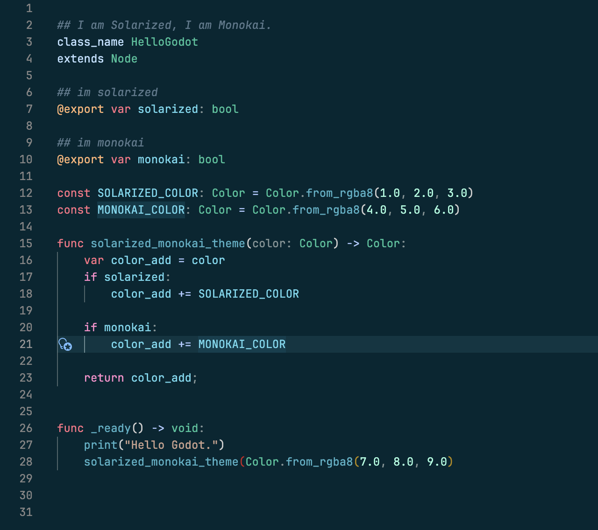

# Solarized Dark Monokai

A VS Code dark theme that combines Solarized Dark's elegant colors with Monokai-inspired syntax highlighting.

## Preview

The theme features:
- Solarized Dark's signature cyan, blue, and yellow palette for UI elements
- Monokai-style vibrant syntax highlighting for code
- Carefully designed contrast for long coding sessions

## Installation

### From Source

1. Clone this repository
2. Run `vsce package` to generate the VSIX file
3. Install following the steps above

## Activation

1. Press `Ctrl+Shift+P` (Windows/Linux) or `Cmd+Shift+P` (macOS) to open Command Palette
2. Type "Theme" and select "Preferences: Color Theme"
3. Choose "Solarized Dark Monokai"

## License

MIT
